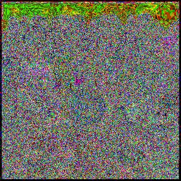

# rabin-cryptosystem
Rabin's cryptographic system implementation for text and images. Rabin's system is a public key cryptosystem with some interesting computational features (like a fast encryption) but the decryption's part suffers from the fact that the decrypted message is not unique (we have four different outputs). In images this issue can be easily overcome due to the particular numerical domain of pixels, but in text it requires a padding process. In the pdf file these procedures are highlighted and examined in a rigorous mathematical way.
Some examples from original to encrypted to decrypted images:

  
   
  

  
   
  

The full report is available at: http://bit.ly/rabinreport
